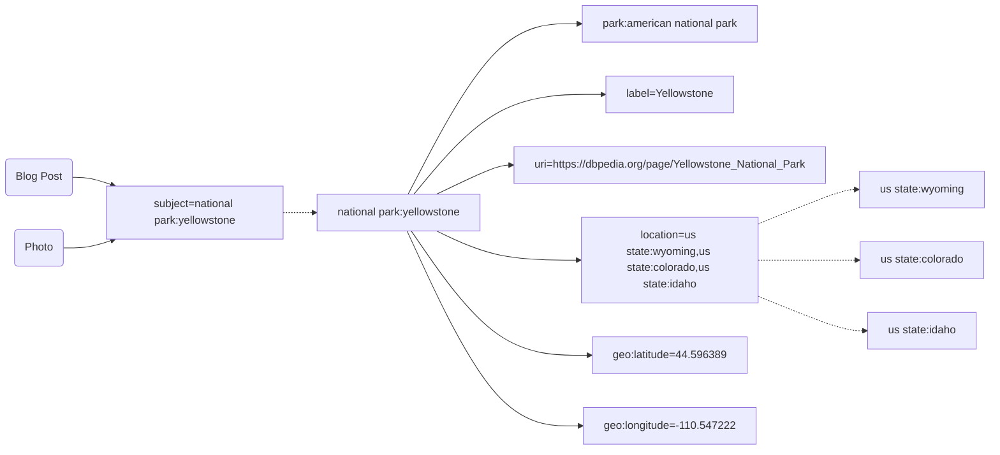

# 0013 - Tagging
**Updated:** <!-- DD Mon YYYY --> 19 Feb 2025

## Status
<!-- Proposed | Accepted | Rejected | Deprecated | Superseded -->
Accepted

## Context
<!-- What is the issue that we’re seeing, that is motivating this decision or change -->
When cataloging items to make them searchable, there's two main ways to organize them: into "folders" or "tagging" them. The "folder" method is like a filing cabinet or a "tree of life" taxonomy: every item has its place, and similar items are clustered together at the same sublevel. The issue with a folder method is what to do when an item could be in two places at once. Computer file systems get around this issue by being able to create "shortcuts" that allow items to appear in more than one place when in reality the true item is in only one place.

Tagging allows each piece of data be annotated with multiple things, to show which higher-level groupings it belongs to. [This video](https://youtu.be/wTQeMkYRMcw?si=ys1VbX9Hr7FmE1Ku) does a good job of covering the main tension between folders vs. tagging organization systems. 

### Example
To visualize our problem and potential solutions, we'll use Yellowstone National Park as an example. "Yellowstone National Park" as a concept is a label that relates to a physical plot of land. That land is a park, but it's a specific type of park focused on conservation and owned by the govnernamet (a "national park"). Portions of it are in Wyoming, Colorado, and Idaho.

In a basic tagging setup, if we have an article written about Yellowstone, we could give it the tag "Yellowstone". Then we can give the "Yellowstone" tag its own tags of "Park", "National Park", "Wyoming", "Colorado", and "Idaho".

This is a fairly-robust setup, but it has some significant shortcomings:
* "Park" and "National Park" are redundant.
* "Yellowstone" isn't very unique (there's also also a TV series and a village in Alberta named "Yellowstone")
* This layout includes the state-level, but doesn't include the county-level, nor rolling up to national or planetary location
* There's no clear way to include parameters like a latitude and longitude value for it (that info may be in the article, but it really "belongs" to the concept of "Yellowstone National Park" itself, rather than the words of the article)

Let's modify our system to have some hierarchy to the tags: the article written about Yellowstone gets a tag of `Yellowstone`. The `Yellowstone` tag gets tagged with `park:american national park`, `us state:wyoming`, `us state:colorado`, and `us state:idaho`. The `park:american national park` tag gets tagged with `park:national park` as well.

With this setup, people searching for `park:*` (any sort of park), `park:national park` (governent-controlled parks of any government), `park:american national park` (any park specifically within the American National Parks system), or `us state:colorado` (anything related to the US state of Colorado) would find the tagged article.

But we've still got ambiguity for what `Yellowstone` itself is. This can be replaced with `park:american national park:yellowstone` and then it has intrinsically the other park levels built-in as tags. Individual users may not wish to get that specific and might just opt for `national park:yellowstone` (if this data repository primarily deals with American things).

### References
[OpenStreetMap Tags](https://wiki.openstreetmap.org/wiki/Tags) work to great effect across multiple types of editors and many types of data within one big data repository. Key aspects of their system include using colons (`:`) to denote _namespaces_ to give heirarchy to tags, and the ability for tag values to be other tags. Within the OpenStreetMap data set, the datastore itself enforces no restrictions on what sort of values different tags have. The only logic comes from human-focused descriptions in their wiki to give editors and moderators a touch point for how things "should" be done.

[Obsidian tags](https://help.obsidian.md/Editing+and+formatting/Tags) can have hierarchy (using `/` as the separator), but do not have further metadata about themselves (they cannot have a description or be tagged themselves).

MediaWiki as a wiki engine has [categories](https://www.mediawiki.org/wiki/Help:Categories) which act similar to tags. They are separate from the main wiki articles themselves, but also can have a full description/article attached to them. Catgories can be categorized into higher-level categories, though they don't show the breadcrumb navigation to trace a nested category back to the root easily. Some wikis have [disambiguation](https://en.wikipedia.org/wiki/Wikipedia:Disambiguation) practices, but these are not built into the wiki engine, but a way to deal with identifiers that are not unique.

## Decision
<!-- What is the change that we’re actually proposing or doing. -->

* Tags are identified by a lower-case UTF-8 string, using colon characters (`:`) as hierarchy divisions.
  * Hierarchy divisions should be used to disambiguate similiarly-named items.
  * Tag identifiers shall not be longer than 32 characters.
  * Tag identifiers shall not contain the characters `(`, `)`, `=`, `*`, `,`, `;`
* Tag values are UTF-8 strings, and default to "yes".
  * If a tag value starts with `data:` then it is parsed as a Data URI ([RFC 2397](https://www.rfc-editor.org/rfc/rfc2397.html)) (and has no length constraint).
  * If a tag value starts with `http:`, `https:`, `ipfs:` or `ar:`, then it is parsed as a URI (and has no length constraint).
  * Otherwise parse the tag value as a tag identifier, or a comma-delimited or semicolon-delimited list of tag identifiers (where each tag identifier shall not be longer than 32 characters).
* If a tag value is to be a plain string, and has any special characters, it should use `data:text/plain,` as a prefix (marking it explicitly as a Data URI, which can have special characters)
* The subject of a tag (the thing being tagged) can be an external thing (identified by its own identification scheme), or another tag
* Several standard tags are expected to be used in specific ways, when used to tag other tags:
  * `label`: Human-friendly summary of the tag
  * `uri`: A link to a canonical representation of this concept
  * `subject`: A link not to information about the object itself, but about what the object represents
  * `part`: A way to divide an item into smaller pieces, to be able to tag them separately. The value of the `part` tag should be a label for the part, and may not contain any special characters. Part labels only need to be unique within an individual subject.
  * `alias`: An alternate identifier/label of the thing.
* A list of tags shall be listed as a comma-delimited list. No additional spaces shall be used around the commas as padding.

### Example
Using the same example of tagging Yellowstone National Park:

Tagging the article with `yellowstone`, tagging `yellowstone` with `american national park`, tagging `american national park` with `national park`, and tagging `national park` with `park` (four distinct tags) is not the same as tagging the article with `park:national park:american national park:yellowstone` (one tag; spaces are not separators between tags). The former gives an identifier of `yellowstone` to the concept, while the latter is more-specific and gives `park:national park:american national park:yellowstone` as the identifier for that one concept. Generally more-specific is good, but this contrived example pushes it too far. Tags having a limit of 32 characters enforces users find a middle-ground between these two.

Tagging the article with `yellowstone` (a key alone, with no value; effectively `yellowstone=yes`) is acceptable, but `topic=yellowstone` is preferred to give a more clear link.

A recommended middle-ground set of tags that would represent "Yellowstone National Park" is:
* Tag `national park:yellowstone` tagged `park:american national park`
* Tag `national park:yellowstone` tagged `label=Yellowstone`
* Tag `national park:yellowstone` tagged `uri=https://dbpedia.org/page/Yellowstone_National_Park`
* Tag `national park:yellowstone` tagged `location=us state:wyoming,us state:colorado,us state:idaho`
* Tag `national park:yellowstone` tagged `geo:latitude=44°35'47"N`
* Tag `national park:yellowstone` tagged `geo:longitude=110°32'50"W`
* An article about Yellowstone tagged `subject=national park:yellowstone`
* A photograph taken at Yellowstone tagged `subject=national park:yellowstone`

Here is a visual, using solid arrows to indicate tags that have been added, and dotted lines showing where the value of a tag is another tag.

### Part example
A situation that might arise is needing to tag different parts of a subject. As an example (from [TagStudio](https://youtu.be/x_x3FYfykgc?si=STz9aL0et6F7PdaT&t=583)), if a particular item involves multiple "subjects", how to indicate "these tags relate to Subject A, while those tags relate to Subject B"? If a single item that has tags `subject=cat,dog`, `expression:surprised`, it's ambiguous whether the cat or the dog (or both) is surprised.

To solve this, A photograph of a cat and a dog, where the cat looks surprised should be tagged with:
* The photo tagged `part=C,D`
* The photo tagged `subject=outdoors`
* Part `C` tagged `subject=cat`
* Part `C` tagged `expression:surprised`
* Part `D` tagged `subject=dog`

This then clearly indicates the cat is the one who is surprised, and the photograph in its entirely is outdoors. A tool created to search for tagged items should find this photo for searches of "cats that are surprised", "cats that are outdoors", and "dogs that are outdoors", but not "dogs that are surprised".

### Attestations
When being saved as an attestation, a schema should be constructed to make it easy to do bulk tagging with minimal attestations. The schema for tagging items should be
* `subjects`: an array of strings. Each item is a unique identifier for some subject to be tagged. These values should be formatted as a URI, so could be a standard web link (e.g. `https:` as scheme prefix), permaweb link (e.g. `ipfs:` as scheme prefix) to refer to external things.
  * If the subject is a tag, the scheme `tag:` should be used as prefix.
  * If the subject is a part of another subject, the subject shall be `part:{subject ID},{part label}`. This gives each subject its own namespace of part names to reference. Note, a subject's identifer is a URI, and if it has a comma in it, it should be escaped. But if it's not, parsers should look for the last comma in the string and assume the text after it is the part label.
* `tags`: an array of strings. Each item is a list of one or more tags

Interfaces that parse these Attestations should take the first item from the `subjects` array, and tag it with the first entry in the `tags` array. Then the second item in the `subjects` array should be paired with the second item from the `tags` array. And so on until the whole list has been iterated through. If the length of the `subjects` array is different than the length of the `tags` array, the Attestation must be considered invalid.

## Consequences
<!-- Outcomes, both positive and negative -->
Enforcing a naming convention but not dictating specific top-level tags allows for projects to form their own preferred structures. It means that projects will need to coordinate among themselves or have a way to internally alias one tag as being conceptually the same thing as another (to merge in data from another project that uses slightly different wording/namespaces). This is similar to how [`owl:sameAs`](https://www.w3.org/TR/owl-ref/#sameAs-def) adds meaning to RDF ontologies.

Keeping tag identifiers to 32 characters or less encourages a mindset of using a few hierarchy levels, but not going overboard. The inclusion of the `label` property allows for having the tag identifier to be truncated/abbreviated, and still have a good human-friendly label attached.

Storing the tags as Attestations allows for implementations to choose to accept all tags, or filter by signer (perhaps augmented by a [./0011-attested-web-of-trust.md](web of trust)) or other more complicated logic to use some or none of the public pool of tag data.

Using colons as delimiters is visually distinct from URI separators (`/`) and what operating systems use for file folders (`\` on Windows). When showing hierarchical "breadcrumb" navigations, a greater-than symbol (`>`) is often used, but that character needs special escaping if it's sent as a URL parameter or within an HTML document. Using a colon makes it conflict with Data URL syntax, so the tag-parsing logic needs to let Data URLs take priority, and only if what appears to be the URL has a scheme that is an unknown type do we assume it's a tag identifier.

This structure does not cover the concept of "aliases" or "shortcuts". Having `national park:yellowstone` be a global/universal tag is good, but for many projects "yellowstone" is specific-enough to disambiguate what's being talked-about. Individual implementations can use `alias` tags to make preferred names for things, that only get parsed locally (translated into the real tags when saving a tag). This can also be used for translation of a scheme into different languages, managed by the implementing project.
